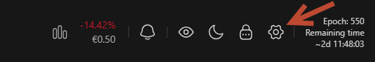
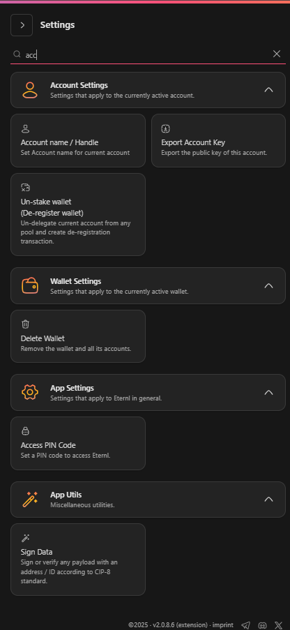

# Settings

<strong>Eternl v2 – Settings menu</strong>

In **Eternl v2**, you can access the settings menu via the **cogwheel** in the top right-hand corner of the screen.\
Clicking it opens the side panel with settings for the current account, wallet, the entire app and some app utilities.

<figure><figcaption></figcaption></figure>

Clicking the cogwheel in the upper-right corner opens the settings menu.

<figure><figcaption>
<em>Settings menu overview</em>
</figcaption></figure>

***


Use the search bar at the top to **quickly find settings**.


As soon as you enter the **second character**, the list is **instantly filtered** across the 4 sub menus.

<figure><figcaption>
<em>Settings filtered by search term</em>
</figcaption></figure>

