<!-- markdownlint-disable-file MD033 -->

# Settings

Account Settings

<figure><figcaption>

</figcaption></figure>

Overview



<figure><figcaption></figcaption></figure>

Account name / handle

<figure><figcaption>
Here you can choose an account name to be displayed or choose one of the $handles in your active account to be displayed.
</figcaption></figure>

Export Account Key

<figure><figcaption>
Here you can export the public key of your current account.
</figcaption></figure>

### Cardano Public Account Key Formats

Cardano supports several public account key formats, each used to view wallet information but **not to sign transactions**. When imported, these keys create **read-only wallets**:

* **`acct_xvk`**: A Cardano-specific extended account public key (Bech32), including both the public key and chain code. Used for deriving address keys in hierarchical deterministic (HD) wallets.
* **`xpub`**: A general extended public key (Base58 or hex) from standards like BIP32, also containing a chain code. Used for address derivation across various wallet systems.
* **`acct_vk`**: A non-extended account public key (Bech32) that includes only the public key. Used for viewing wallet details or verifying signatures.

These key formats enable wallet **monitoring and address generation**, but **cannot be used to access funds or sign transactions**.

Single Address Mode (SAM) [option]

Only use a single address for all transactions.

When enabled, all funds will be held on the first receive address by default.

<figure><figcaption>
Option switch Single Address Mode (SAM)
</figcaption></figure>

Alternatively a custom receive address can be set here.

Setting a custom receive address will make all change outputs and receive address switch to this address, even if not owned by this account. Please be sure to verify that the correct address is set.

Collateral [option]

<figure><figcaption>
Option - Switch Collateral
</figcaption></figure>

### Collateral (Cardano)

### What is Collateral?

In the Cardano blockchain, **collateral** is a special UTxO (Unspent Transaction Output) set aside to cover transaction fees if a smart contract (Plutus script) **fails** during execution.

* If the script **succeeds**, the collateral is untouched.
* If the script **fails**, the collateral is used to pay the **transaction fee only**, not the full amount.

This system ensures users are responsible for failed executions, helping to protect the network from spam or abuse.

> The **collateral is never locked.** It can still be spent in any transaction that does **not** require collateral.

---

### Using Collateral in Eternl

The **Eternl wallet** provides a feature called **Collateral**.

> When the Collateral Switch is **ON**, Eternl will automatically select a suitable UTxO to be used as collateral, if available in your wallet.

This means:

* You do not need to manually choose a collateral UTxO.
* Interactions with smart contracts and dApps are handled smoothly.
* The selected collateral is only used **if a contract execution fails**, and only to cover **fees**.

> This helps ensure secure and seamless usage of smart contracts on Cardano through the Eternl wallet.

---

### Collateral Summary

* Collateral is **required** for transactions involving Plutus smart contracts.
* Collateral is **never locked** and can be spent in regular (non-contract) transactions.
* Eternl automates collateral management when the **Collateral Switch** is enabled.
* Collateral UTxOs are only consumed **if a transaction fails**, and only to cover **fees**.

Manual sync [option]

<figure><figcaption>
Manual sync option
</figcaption></figure>

### What is Manual Sync?

In Eternl, **Manual Sync** is an optional setting that allows you to control **when** your wallet fetches the latest data (such as balances, UTxOs, and transaction history) from the blockchain.

By default, this setting is **OFF**, meaning the wallet performs **automatic syncing** in the background.

---

### Automatic Sync (Default)

* The wallet refreshes data **automatically** at regular intervals.
* Keeps balances and UTxOs **up to date** without user input.
* Convenient for most users.

---

### Manual Sync (When turned ON)

When enabled, syncing will **only occur when you manually trigger it** by pressing the **sync button** in the interface.

---

### Advantages of Manual Sync

* **Faster UI response**: Reduces background activity, especially useful on low-power devices or slow networks.
* **More control**: Ideal for advanced users who want to control when blockchain state updates.
* **Useful in testing/debugging scenarios** where state consistency is critical.

---

### Disadvantages of Manual Sync

* **Outdated balances**: You may see stale wallet data until you manually sync.
* **Extra effort**: Requires remembering to sync before sending transactions or interacting with dApps.
* **May cause confusion**: New users might not realize data is not current.

---

### Sync Summary

| Mode                    | Sync Method         | Best For                                   |
| ----------------------- | ------------------- | ------------------------------------------ |
| **Automatic** (default) | Background sync     | Most users (easy & up to date)             |
| **Manual**              | User-triggered sync | Power users, low-resource devices, testing |

> **Tip:** If you're unsure, it's best to leave Manual Sync **off** for a smoother experience.

History sync [option]

<figure><figcaption></figcaption></figure>

The **History Sync** option controls whether your Eternl wallet **syncs your full transaction history** with the blockchain.

> When **enabled**, Eternl will fetch your complete historical activity (incoming/outgoing transactions, metadata, etc.).

---

### What is History Sync?

Cardano wallets can operate with **minimal sync** (just balances and UTxOs) or with **full history sync**. This setting determines which mode Eternl uses.

* **ON**: Full transaction history is retrieved and displayed.
* **OFF**: Only your current balance and available UTxOs are shown, not past transactions.

---

### Advantages of History Sync (ON)

* See your full transaction history in-app.
* Useful for auditing, record keeping, or tax purposes.
* Easier to track smart contract interactions or NFT transfers.

---

### Disadvantages

* **Slower sync time**, especially for older or busy wallets.
* Higher memory and data usage.
* Not needed for simple transfers or light use.

---

### Summary Table

| Setting           | Sync Behavior                      | Best For                           |
| ----------------- | ---------------------------------- | ---------------------------------- |
| **ON**            | Full transaction history is synced | Power users, bookkeeping, audits   |
| **OFF** (default) | Faster sync, no history loaded     | Everyday users, faster performance |

> **Tip:** If you just need to send/receive ADA or NFTs, you can leave this **OFF** for quicker syncs.

---

### Recommendation

Enable **History Sync** if:

* You need to track past transactions or use the wallet for business or DeFi.
* You are troubleshooting contract calls or asset transfers.

Keep it **disabled** if:

* You want the wallet to load quickly and do not need old records.

Token Fragmentation (TF)

### Reduce transaction fees by fragmenting tokens

<figure><figcaption></figcaption></figure>

**Token Fragmentation** is an advanced sending option that controls how tokens are grouped when a transaction is made.

> When enabled, the wallet will **split tokens into bundles** if the number of tokens in the **change output** exceeds a defined threshold.
> **Default value:** `20` tokens per UTxO

### Purpose

This helps **reduce UTxO bloat** and improves **token management** by avoiding overly large token bundles in change.

### How it works

* During a transaction, if the wallet detects that the change output would include **more tokens than the set limit**, it will **automatically split** them into smaller, more manageable outputs.
* This behavior depends on your wallet's current **UTxO and token distribution**.

### Tweaking for Best Results

To get optimal results:

* You may need to **adjust the threshold value** based on your wallet's token composition.
* Different distributions may require different configurations to achieve the desired outcome.

---

> **Tip:** Token Fragmentation can help avoid failed transactions caused by oversized outputs or complex UTxO sets.

### Token Bundle Size

The **Token Bundle Size** setting defines the **maximum number of tokens** each UTxO output should contain when tokens are fragmented.

> **Default value:** `20` tokens per UTxO\
> This value is adjustable based on your specific needs.

### What does it affect?

Changing this value affects how tokens are distributed across outputs when sending transactions:

* **Lowering the value (<20)** splits tokens into **smaller bundles**.
* **Lowering the value (<20)** can lead to **lower transaction fees**.
* **Lowering the value (<20)** means **more ADA locked** in multiple UTxOs.
* **Increasing the value (>20)** groups more tokens per UTxO.
* **Increasing the value (>20)** can lead to **higher transaction fees**.
* **Increasing the value (>20)** means **less ADA locked**, which can be more efficient for frequent use.

> **Tip:** Lower values are better for minimizing fees in simple wallets. Higher values can be more efficient for wallets handling many tokens or dApp interactions.

Advanced UTxO Management

<figure><figcaption></figcaption></figure>

When this feature is **enabled**, Eternl applies advanced logic to optimize how your wallet handles UTxOs during transactions.

* It attempts to maintain at least **10 available UTxOs** to support **parallel transaction execution**, improving performance and responsiveness.
* Additionally, it tries to reserve a dedicated **5 \{{currency\}} collateral UTxO** for use with **smart contract interactions**.

> This setting is especially useful for users interacting with dApps, submitting multiple transactions, or participating in DeFi.

Auto Withdrawal [option]

<figure><figcaption></figcaption></figure>

Wallet Settings

Name and Group

<figure><figcaption>
Update wallet name and assign it to a group.
</figcaption></figure>

Use this section to customize how your wallet appears inside Eternl:

* Rename the wallet for easier identification.
* Assign the wallet to a group to organize multiple wallets more clearly.
* These labels are local to the app and have no impact on the blockchain.

Wallet Spending Password

The wallet spending password is used to authorize sensitive actions in Eternl:

* It is required when sending funds or interacting with supported dApps.
* You can update it at any time from this section.


Losing this password does **not** mean your funds are lost, but you will need to recover the wallet to set it up again.


Wallet Icon

<figure><figcaption>
Customize or generate a wallet icon.
</figcaption></figure>

Choose a visual identifier for the wallet to make it easier to recognize at a glance:

* Assign a custom icon or generate a random one.
* Helpful when you manage several wallets in the same app.
* This has no functional or blockchain impact.

Export Wallet

<figure><figcaption>
Export wallet as encrypted JSON file.
</figcaption></figure>

Export your wallet as an encrypted JSON file for use in another Eternl instance:

* The export contains encrypted wallet data.
* It can be imported into other Eternl browsers or devices.


This file is sensitive and should be stored securely. It does **not** replace a proper recovery phrase backup.


Re-sync wallet

Re-syncing forces the wallet to rebuild its state from blockchain data:

* Useful if transactions are missing or balances appear incorrect.
* Helps resolve sync inconsistencies without changing your funds.


This process may take some time, depending on the wallet history.


Recovery phrase verification

Use this check to confirm that your recovery phrase was stored correctly:

* It helps prevent loss of access caused by an incomplete or incorrect backup.
* It is a good safety step after creating or importing a wallet.


Your recovery phrase gives full control over your funds. Never share it with anyone.


Delete Wallet

<figure><figcaption>
Permanently remove a wallet from the app.
</figcaption></figure>

This removes the wallet from the current device and app installation only.


Funds are **not** deleted from the blockchain. You need the recovery phrase to restore access later. Without the recovery phrase, access to the funds is lost permanently.


App Settings

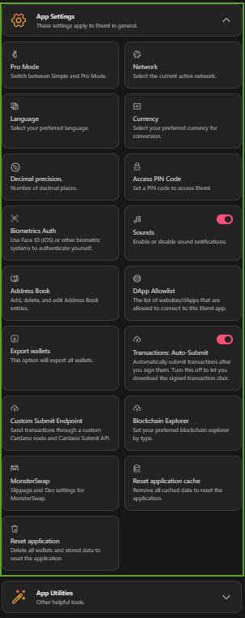

These settings apply **globally** to the Eternl app on this device. They affect the overall app behavior, display, connectivity, and convenience features rather than a single wallet.

Pro Mode

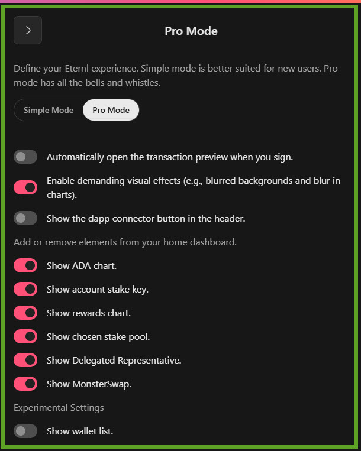

Use `Pro Mode` to switch between a simpler interface and a more advanced one.

**When to use it:**
* **Beginners** should usually stay in **Simple** mode.
* **Advanced users** can use **Pro** mode for more control and more detailed options.

**Important:**
* More control also means more room for mistakes if you are unfamiliar with the settings.

Network

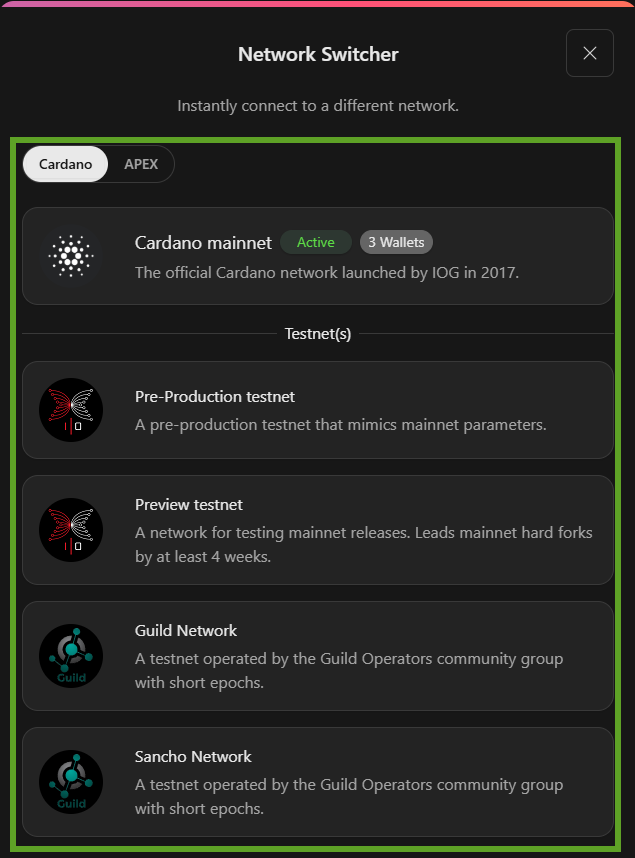

Use `Network` to choose which Cardano environment Eternl connects to, such as **Mainnet** or **Testnet**.

**When to use it:**
* Use **Mainnet** for normal wallet activity and real funds.
* Use **Testnet** for testing, development, or learning without real assets.

**Important:**
* Funds are **not shared** between networks.
* A wallet on **Mainnet** is separate from a wallet on **Testnet**.

Language

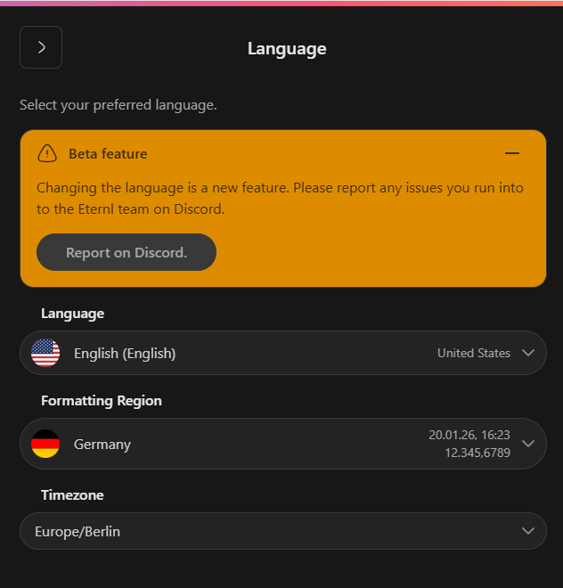

Use `Language` to change the app interface language and related regional display settings where available.

**When to use it:**
* Change it if you prefer a different UI language.
* Adjust it if dates, numbers, or regional formatting should match your locale.

Currency

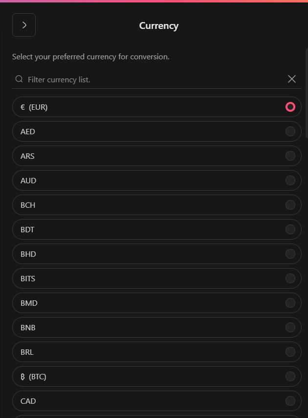

Use `Currency` to choose the **fiat display currency** used for value conversion inside the app.

**When to use it:**
* Select the currency you normally use for pricing and portfolio reference.
* Change it if you want market values shown in another local currency.

Decimal Precision

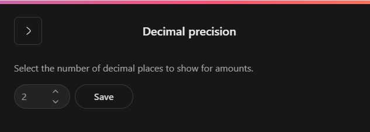

Use `Decimal Precision` to control how many decimal places are shown for balances and values.

**When to use it:**
* Use fewer decimals for a cleaner overview.
* Use more decimals if you want more exact number formatting.

Access PIN Code

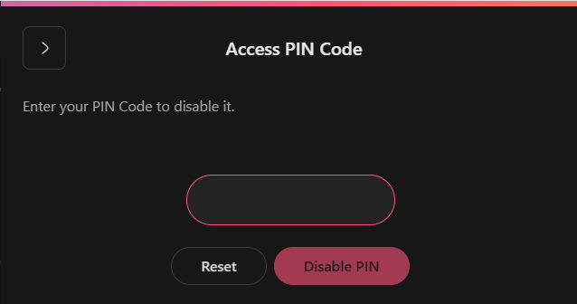

Use `Access PIN Code` to add an extra app-level lock when opening Eternl on your device.

**When to use it:**
* Enable it if other people may access your device.
* Use it for faster everyday protection than entering a wallet recovery phrase.

**Important:**
* A PIN protects app access, but it is **not** a replacement for your recovery phrase.

Biometrics Auth

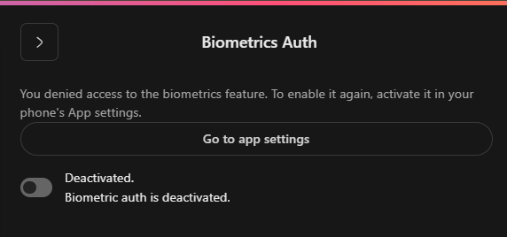

Use `Biometrics Auth` for device-level authentication such as **Face ID** or **fingerprint** where supported.

**When to use it:**
* Enable it for quicker secure access on supported devices.
* Use it if you already trust the biometric setup of your phone or computer.

**Important:**
* Availability depends on your device settings and operating system support.

Sounds

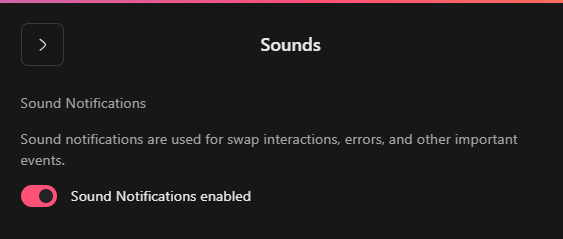

Use `Sounds` to enable or disable app sounds and notification feedback.

**When to use it:**
* Turn it on if you want audible confirmation for actions.
* Turn it off if you prefer a quieter experience.

Address Book

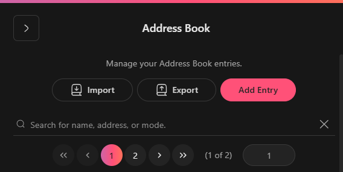

Use `Address Book` to manage saved recipient addresses inside Eternl.

**When to use it:**
* Save addresses you use often.
* Add labels so contacts are easier to recognize.
* Import or export address book entries when needed.

DApp Allow List

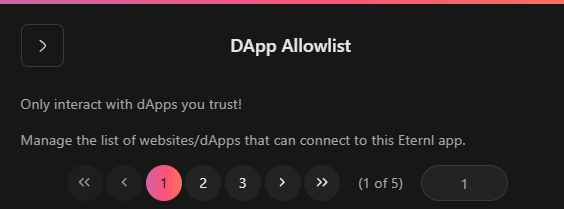

Use `DApp Allow List` to control which dApps are allowed to connect to this Eternl app.
whit
**When to use it:**
* Review connected dApps periodically.
* Remove sites you no longer use.
* Keep access limited to trusted dApps only.

**Important:**
* Only interact with dApps you trust.
* This helps prevent malicious or unwanted connections.

Export Wallets

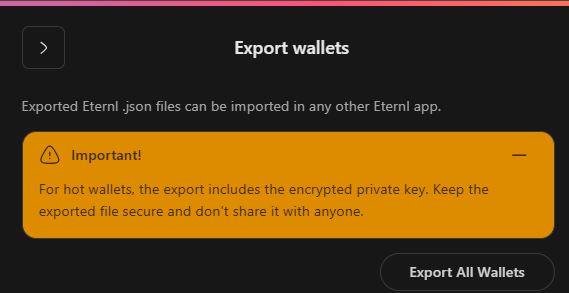

Use `Export Wallets` to export multiple wallets from the app in one step.

**When to use it:**
* Use it when moving to another Eternl installation.
* Use it if you need an encrypted backup of wallet data stored in the app.

**Important:**
* The export includes **encrypted private keys**.
* Treat the export file with the same care as your **seed phrase**.

Transactions: Auto-Submit

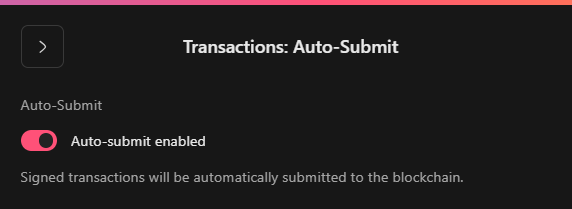

Use `Transactions: Auto-Submit` to automatically send signed transactions to the network after signing.

**When to use it:**
* Keep it enabled for a faster standard workflow.
* Disable it if you want to inspect, download, or submit signed transactions manually.

**Important:**
* Turn it off if you want more manual control over transaction submission.

Custom Submit Endpoint

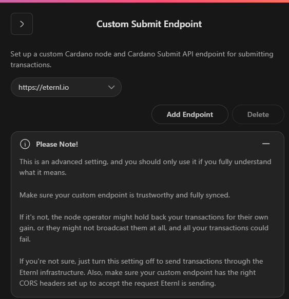

Use `Custom Submit Endpoint` to send transactions through a custom node or API endpoint instead of the default setup.

**When to use it:**
* Use it only if you know exactly which endpoint you want to submit through.
* Useful for specialized infrastructure or advanced testing setups.

**Important:**
* This is an **advanced** feature.
* It should only be used by experienced users.
* A bad or untrusted endpoint can cause transaction failure or unwanted manipulation.

Blockchain Explorer

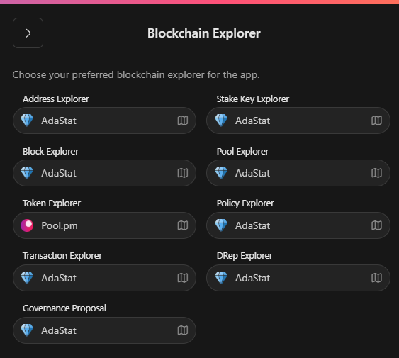

Use `Blockchain Explorer` to choose which explorer Eternl opens for different item types.

**When to use it:**
* Pick the explorer you prefer for **addresses**.
* Set explorer behavior for **transactions**, **tokens**, **pools**, and **governance** links.

MonsterSwap

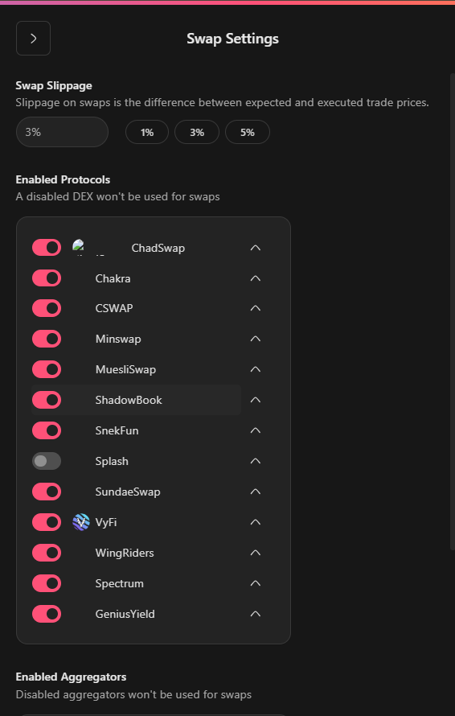

Use `MonsterSwap` to manage swap-related settings such as **slippage** and other DEX-specific behavior.

**When to use it:**
* Adjust it if a swap needs more flexible slippage settings.
* Review it before using DEX features that depend on swap execution.

**Important:**
* Higher slippage settings can increase execution risk and worse pricing.

Reset Application Cache

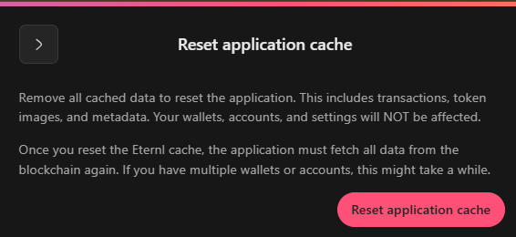

Use `Reset application cache` to clear cached app data without removing your wallets.

**When to use it:**
* Use it if the app behaves oddly after updates or stale cached data.
* Try it before using more drastic reset options.

**Important:**
* This clears cached data only.

Reset Application

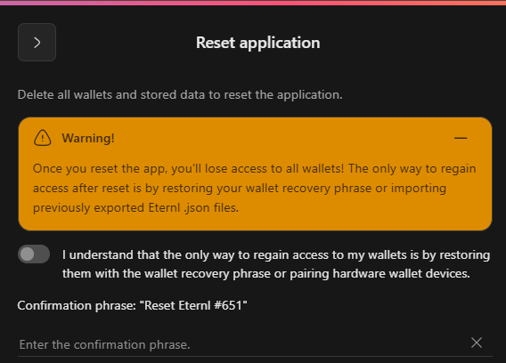

Use `Reset Application` to delete **all wallets** and app data stored in Eternl on this device.

**When to use it:**
* Use it only if you intentionally want a full local reset of the app.
* Make sure every wallet is backed up first.

**Important:**
* This action deletes all local wallets and stored app data.
* Funds are **not** lost if you still have the correct recovery phrase.
* Without the recovery phrase, access to the funds is lost **permanently**.

App Utilities

<figure><figcaption>

</figcaption></figure>

Franken Address Generator

Create a new address by combining any two addresses.

This is an **advanced utility** for constructing or modifying Cardano addresses. It is typically relevant for testing, analysis, or debugging workflows rather than normal wallet use.

**When to use it:**
* Testing address formats
* Advanced wallet or debugging scenarios

**Important:**
* This is **not** intended for normal users.
* Incorrect usage can result in unusable or invalid addresses.

Sign Data

Sign or verify any payload with an address / ID according to the CIP-8 standard.

This utility lets you **sign arbitrary data** with a wallet key. It is commonly used for authentication, verification, or proving ownership of a wallet-controlled identity.

**When to use it:**
* Verifying wallet ownership
* Web3 or dApp authentication

**Important:**
* Never sign unknown or untrusted data.
* Signing data does **not** send funds, but it can still be used maliciously in the wrong context.

