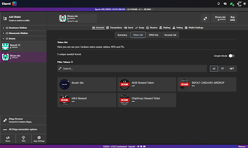
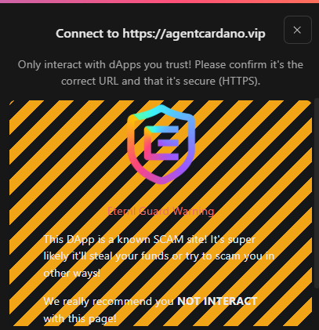
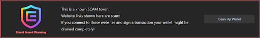
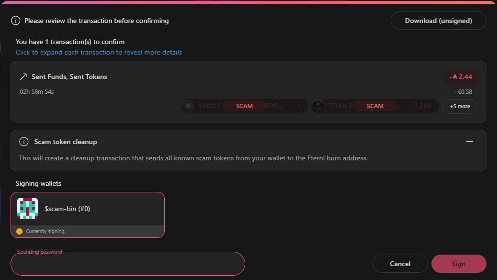

# Introduction of Eternl Guard

While the crypto space offers a lot of opportunities and chances for a broad public, there are also scammers that want to steal your funds.

Because of the permissionless and self custody design of blockchain applications only you have full control over your funds as well as full responsibility for everything that happens to them. So if you give  your seed phrase to  a bad actor, or connect your wallet and authorize a transaction with a scam site you will lose your funds with no way to recover them.

To help users keep their funds safe, we created Eternl Guard. Eternl Guard has a list of known scam tokens and domains which is used to inform users. It will mark tokens in your wallet that are designed to lead you to malicious DApps/sites. If you decide to visit this site regardless of the in-wallet warnings, the connection popup will show a clear warning to be cautious and not connect to a known malicious DApp/site.

## Feature highlights

### 1. Scam token marking

Eternl will now mark known scam tokens as SCAM in both your transaction history and token overview. This in addition to graying out token metadata and a disclaimer on the token popup will warn for known scam tokens. It should be noted that this accounts for only known tokens, so if you're the first one to receive a new token, it would potentially not be flagged.

### 2. Malicious DApp connection alert

When connecting to a known malicious DApp, Eternl will now show a soft-blocking warning on the connector, which requires you to acknowledge you're about to connect your wallet to a known malicious DApp. While connecting in itself has no inherent risks, it should be avoided.
After waiting for 10 seconds and confirming you're aware of connecting to a known malicious DApp, you can hide this warning and connect like you're used to. This warning will only show while the connection has not been approved yet. If you connect once and add the DApp to your allowlist, it will not show again.

## 3.Wallet Cleanup

If you view scam tokens under “Assets”, you will see a “Clean up” button. Clicking this button automatically creates the required transaction.

This feature allows you to remove known scam tokens from your wallet efficiently. Instead of sending each token individually, the clean-up process bundles them into a single transaction, reducing overall transaction fees.

The tokens are sent to Eternl’s designated wallet (ADA Handle: $burnit).

