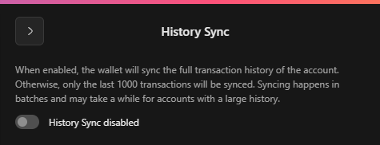
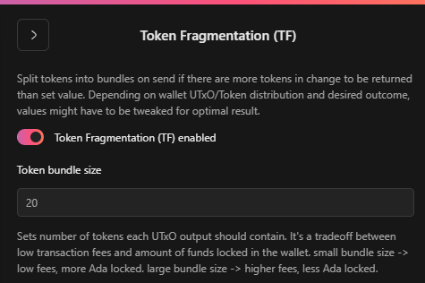

# Account settings

<strong>Eternl v2 - Account Settings menu</strong>

 (1) (1).png>)

Account name / handle

<figure><figcaption>
Here you can choose an account name to be displayed or choose one of the $handles in your active account to be displayed.
</figcaption></figure>

Export Account Key

### Export the public key of this account.

<figure><figcaption>
Here you can export the public key of your current account.
</figcaption></figure>

#### Cardano Public Account Key Formats

Cardano supports several public account key formats, each used to view wallet information but **not to sign transactions**. When imported, these keys create **read-only wallets**:

* **`acct_xvk`**: A Cardano-specific extended account public key (Bech32), including both the public key and chain code. Used for deriving address keys in hierarchical deterministic (HD) wallets.
* **`xpub`**: A general extended public key (Base58 or hex) from standards like BIP32, also containing a chain code. Used for address derivation across various wallet systems.
* **`acct_vk`**: A non-extended account public key (Bech32) that includes only the public key. Used for viewing wallet details or verifying signatures.

These key formats enable wallet **monitoring and address generation**, but **cannot be used to access funds or sign transactions**.

Single Address Mode (SAM) [option]

### Only use a single address for all transactions.

When enabled, all funds will be held on the first receive address by default.

<figure><figcaption>
Option switch Single Address Mode (SAM)
</figcaption></figure>

Alternatively a custom receive address can be set here.

> <mark style="color:red;">Setting a custom receive address will make all change outputs and receive address switch to this address, even if not owned by this account. Please be sure to verify that the correct address is set.</mark>

Collateral [option]

### Use Eternl provided collateral?

<figure><figcaption>
Option switch Collateral
</figcaption></figure>

### Collateral (Cardano)

#### What is Collateral?

In the Cardano blockchain, **collateral** is a special UTxO (Unspent Transaction Output) set aside to cover transaction fees if a smart contract (Plutus script) **fails** during execution.

* ✅ If the script **succeeds**, the collateral is untouched.
* ❌ If the script **fails**, the collateral is used to pay the **transaction fee only**, not the full amount.

This system ensures users are responsible for failed executions, helping to protect the network from spam or abuse.

> 🔓 The **collateral is never locked.** It can still be spent in any transaction that does **not** require a collateral.

***

#### Using Collateral in Eternl

The **Eternl wallet** provides a feature called the **Collateral**.

> When the Collateral Switch is **ON**, Eternl will automatically select a suitable UTxO to be used as collateral—if available in your wallet.

This means:

* You don’t need to manually choose a collateral UTxO.
* Interactions with smart contracts and dApps are handled smoothly.
* The selected collateral is only used **if a contract execution fails**, and only to cover **fees**.

> 🛡️ This helps ensure secure and seamless usage of smart contracts on Cardano through the Eternl wallet.

***

### Summary

* Collateral is **required** for transactions involving Plutus smart contracts.
* Collateral is **never locked** and can be spent in regular (non-contract) transactions.
* Eternl automates collateral management when the **Collateral Switch** is enabled.
* Collateral UTxOs are only consumed **if a transaction fails**, and only to cover **fees**.

Manual sync [option]

### Set manual sync

<figure><figcaption>
Manual sync option
</figcaption></figure>

### What is Manual Sync?

In Eternl, **Manual Sync** is an optional setting that allows you to control **when** your wallet fetches the latest data (such as balances, UTxOs, and transaction history) from the blockchain.

By default, this setting is **OFF**, meaning the wallet performs **automatic syncing** in the background.

***

### 🔁 Automatic Sync (Default)

* The wallet refreshes data **automatically** at regular intervals.
* Keeps balances and UTxOs **up to date** without user input.
* Convenient for most users.

***

### ✋ Manual Sync (When turned ON)

When enabled, syncing will **only occur when you manually trigger it** by pressing the **sync button** in the interface.

***

### ✅ Advantages of Manual Sync

* ⚡ **Faster UI response**: Reduces background activity, especially useful on low-power devices or slow networks.
* 🔒 **More control**: Ideal for advanced users who want to control when blockchain state updates.
* 🧪 **Useful in testing/debugging scenarios**, where state consistency is critical.

***

### ❌ Disadvantages of Manual Sync

* 🕒 **Outdated balances**: You may see stale wallet data until you manually sync.
* 🧍‍♂️ **Extra effort**: Requires remembering to sync before sending transactions or interacting with dApps.
* ❌ **May cause confusion**: New users might not realize data isn’t current.

***

### Summary

| Mode                    | Sync Method         | Best For                                   |
| ----------------------- | ------------------- | ------------------------------------------ |
| **Automatic** (default) | Background sync     | Most users (easy & up to date)             |
| **Manual**              | User-triggered sync | Power users, low-resource devices, testing |

> 💡 **Tip:** If you're unsure, it's best to leave Manual Sync **off** for a smoother experience.

history sync [option]

###

### Set history sync

<figure><figcaption></figcaption></figure>

The **History Sync** option controls whether your Eternl wallet **syncs your full transaction history** with the blockchain.

> When **enabled**, Eternl will fetch your complete historical activity (incoming/outgoing transactions, metadata, etc.).

***

#### 🔍 What is History Sync?

Cardano wallets can operate with **minimal sync** (just balances and UTxOs) or with **full history sync**. This setting determines which mode Eternl uses.

* 🔄 **ON**: Full transaction history is retrieved and displayed.
* 💤 **OFF**: Only your current balance and available UTxOs are shown — not past transactions.

***

#### ✅ Advantages of History Sync (ON)

* 📜 See your full transaction history in-app
* 🔍 Useful for auditing, record keeping, or tax purposes
* 🧠 Easier to track smart contract interactions or NFT transfers

***

#### ❌ Disadvantages

* 🐢 **Slower sync time**, especially for older or busy wallets
* 🔋 Higher memory and data usage
* Not needed for simple transfers or light use

***

#### 📌 Summary Table

| Setting           | Sync Behavior                      | Best For                           |
| ----------------- | ---------------------------------- | ---------------------------------- |
| **ON**            | Full transaction history is synced | Power users, bookkeeping, audits   |
| **OFF** (default) | Faster sync, no history loaded     | Everyday users, faster performance |

> 💡 **Tip:** If you just need to send/receive ADA or NFTs, you can leave this **OFF** for quicker syncs.

***

### 🧭 Recommendation

Enable **History Sync** if:

* You need to track past transactions or use the wallet for business or DeFi.
* You’re troubleshooting contract calls or asset transfers.

Keep it **disabled** if:

* You want the wallet to load quickly and don’t need old records.

## 🧩Token Fragmentation (TF)

### Reduce transaction fees by fragmenting tokens.

<figure><figcaption></figcaption></figure>

### Token Fragmentation (TF)

**Token Fragmentation** is an advanced sending option that controls how tokens are grouped when a transaction is made.

> When enabled, the wallet will **split tokens into bundles** if the number of tokens in the **change output** exceeds a defined threshold.

> 🧩 **Default value:** `20` tokens per UTxO

#### 🔍 Purpose

This helps **reduce UTxO bloat** and improves **token management** by avoiding overly large token bundles in change.

#### ⚙️ How it works

* During a transaction, if the wallet detects that the change output would include **more tokens than the set limit**, it will **automatically split** them into smaller, more manageable outputs.
* This behavior depends on your wallet’s current **UTxO and token distribution**.

#### 🎯 Tweaking for Best Results

To get optimal results:

* You may need to **adjust the threshold value** based on your wallet’s token composition.
* Different distributions may require different configurations to achieve the desired outcome.

***

> 💡 **Tip:** Token Fragmentation can help avoid failed transactions caused by oversized outputs or complex UTxO sets.

### 📦 Token Bundle Size

The **Token Bundle Size** setting defines the **maximum number of tokens** each UTxO output should contain when tokens are fragmented.

> 🧩 **Default value:** `20` tokens per UTxO\
> 🔧 This value is adjustable based on your specific needs.

#### 📊 What does it affect?

Changing this value affects how tokens are distributed across outputs when sending transactions:

* **Lowering the value (<20):**
  * Splits tokens into **smaller bundles**
  * ⚡ **Lower transaction fees**
  * 🔒 **More ADA locked** in multiple UTxOs
* **Increasing the value (>20):**
  * Groups more tokens per UTxO
  * 💸 **Higher transaction fees**
  * 🔓 **Less ADA locked**, more efficient for frequent use

> ⚖️ **Tip:** Lower values are better for minimizing fees in simple wallets. Higher values can be more efficient for wallets handling many tokens or dApp interactions.

## Advanced UTxO Management

### Use advanced UTxO management on your transactions.

<figure><figcaption></figcaption></figure>

#### 🧠 Advanced UTxO Management

When this feature is **enabled**, Eternl applies advanced logic to optimize how your wallet handles UTxOs during transactions.

* 🔄 It attempts to maintain at least **10 available UTxOs** to support **parallel transaction execution**, improving performance and responsiveness.
* 🛡️ Additionally, it tries to reserve a dedicated **5 \{{currency\}} collateral UTxO** for use with **smart contract interactions**.

> ⚙️ This setting is especially useful for users interacting with dApps, submitting multiple transactions, or participating in DeFi.

### Auto Withdrawal

Automatically withdraw rewards if needed.

<figure><figcaption></figcaption></figure>

