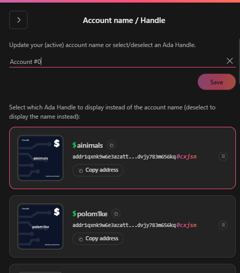
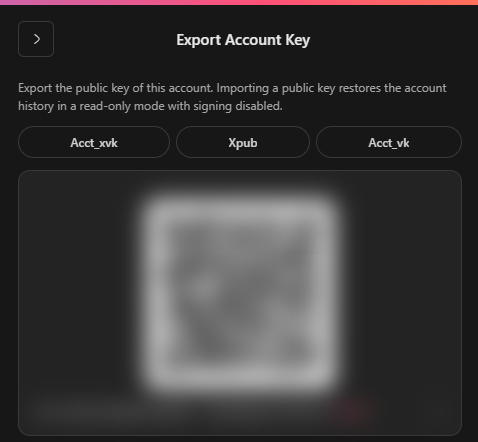
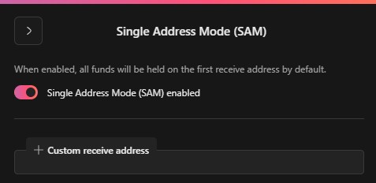
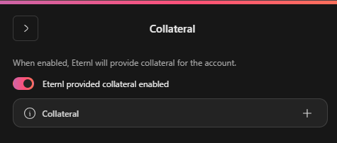

# Account settings

<figure><figcaption>
Active account settings
</figcaption></figure>

### Account name / handle

<figure><figcaption>
Enter an account name or choose a $handle
</figcaption></figure>

Here you can choose an account name to be displayed or choose one of the $handles in your active account to be displayed.

### Export Account Key

<figure><figcaption>
account public key export (read only)
</figcaption></figure>

Here you can export the public key of your current account.

#### Cardano Public Account Key Formats

Cardano supports several public account key formats, each used to view wallet information but **not to sign transactions**. When imported, these keys create **read-only wallets**:

* **`acct_xvk`**: A Cardano-specific extended account public key (Bech32), including both the public key and chain code. Used for deriving address keys in hierarchical deterministic (HD) wallets.
* **`xpub`**: A general extended public key (Base58 or hex) from standards like BIP32, also containing a chain code. Used for address derivation across various wallet systems.
* **`acct_vk`**: A non-extended account public key (Bech32) that includes only the public key. Used for viewing wallet details or verifying signatures.

These key formats enable wallet **monitoring and address generation**, but **cannot be used to access funds or sign transactions**.

### Single Address Mode (SAM)

When enabled, all funds will be held on the first receive address by default.

<figure><figcaption>
Option switch Single Address Mode (SAM)
</figcaption></figure>

Alternatively a custom receive address can be set here.

> <mark style="color:red;">Setting a custom receive address will make all change outputs and receive address switch to this address, even if not owned by this account. Please be sure to verify that the correct address is set.</mark>

### Collateral&#x20;

<figure><figcaption>
Option switch Collateral
</figcaption></figure>

***

## Collateral (Cardano)

### What is Collateral?

In the Cardano blockchain, **collateral** is a special UTxO (Unspent Transaction Output) set aside to cover transaction fees if a smart contract (Plutus script) **fails** during execution.

* ✅ If the script **succeeds**, the collateral is untouched.
* ❌ If the script **fails**, the collateral is used to pay the **transaction fee only**, not the full amount.

This system ensures users are responsible for failed executions, helping to protect the network from spam or abuse.

> 🔓 The **collateral is never locked.** It can still be spent in any transaction that does **not** require a collateral.

***

### Using Collateral in Eternl

The **Eternl wallet** provides a feature called the **Collateral**.

> When the Collateral Switch is **ON**, Eternl will automatically select a suitable UTxO to be used as collateral—if available in your wallet.

This means:

* You don’t need to manually choose a collateral UTxO.
* Interactions with smart contracts and dApps are handled smoothly.
* The selected collateral is only used **if a contract execution fails**, and only to cover **fees**.

> 🛡️ This helps ensure secure and seamless usage of smart contracts on Cardano through the Eternl wallet.

***

### Summary

* Collateral is **required** for transactions involving Plutus smart contracts.
* Collateral is **never locked** and can be spent in regular (non-contract) transactions.
* Eternl automates collateral management when the **Collateral Switch** is enabled.
* Collateral UTxOs are only consumed **if a transaction fails**, and only to cover **fees**.
