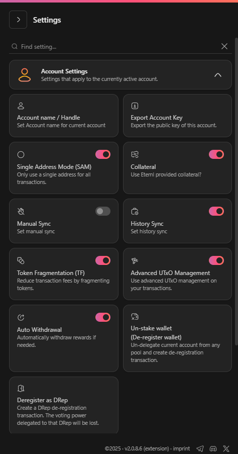

# Account settings

<figure><figcaption>
Active account settings
</figcaption></figure>

### Account name / handle

<figure><figcaption>
Enter an account name or choose a $handle
</figcaption></figure>

Here you can choose an account name to be displayed or choose one of the $handles in your active account to be displayed.
